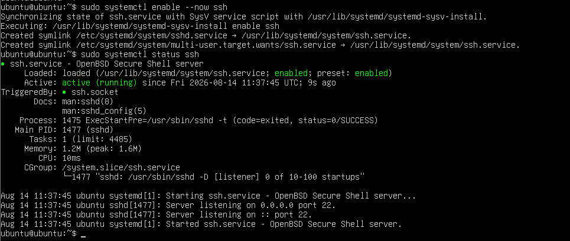
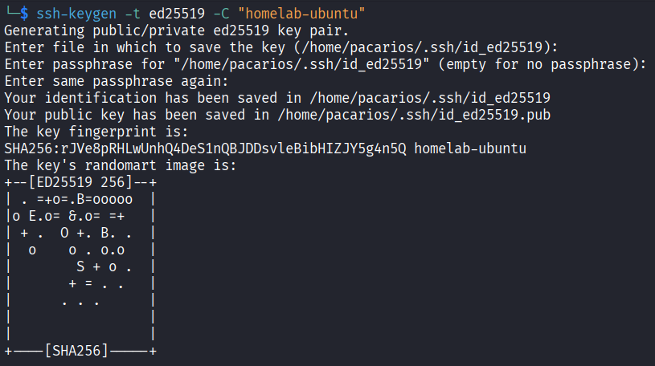
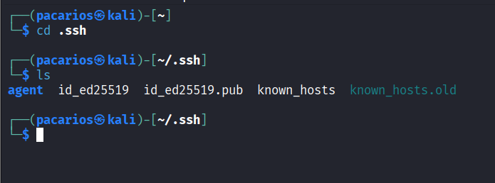
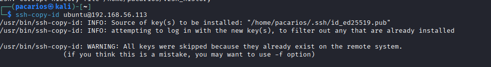
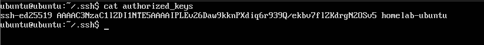
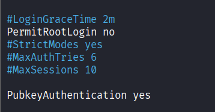
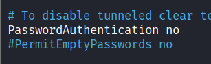
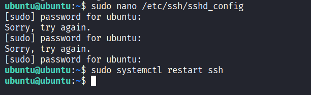
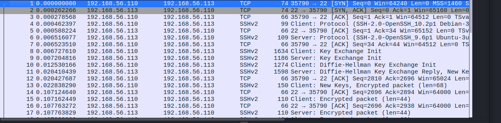

# SSH Key Based Authentication and Hardening

## Objective

While working through HTB's Nexus box, the final privilege escalation step involved injecting an SSH public key into `/root/.ssh/authorized_keys` via a path traversal bug, and the login attempt failed due to a StrictModes permission issue on the target's `.ssh` directory. That failure exposed a gap: I could exploit SSH key based auth but didn't actually understand how the mechanism works under the hood, or how to configure it properly as a defender.

This writeup covers setting up SSH key authentication from scratch on a fresh Ubuntu Server VM, hardening the configuration, and verifying the changes at the log and packet level. This is Week 1 of a defensive security prep plan ahead of a security internship (EDR, mail security, service desk).

## Environment

- Host: Windows PC, 16GB RAM
- Hypervisor: VirtualBox
- Target VM: Ubuntu Server 24.04.4 LTS, 4GB RAM, 2 CPUs, 30GB disk (dynamically allocated)
- Attacker/client VM: Kali Linux
- Networking: dual adapter setup on both VMs, NAT adapter for internet access, Host only Adapter for VM to VM communication on the 192.168.56.0/24 subnet

## Installing SSH

A fresh Ubuntu Server install does not include an SSH server by default unless explicitly selected during setup. Checked service status first:

```
sudo systemctl status ssh
```

Result: `Unit ssh.service could not be found`

Installed and enabled the service:

```
sudo apt update
sudo apt install openssh-server -y
sudo systemctl enable --now ssh
sudo systemctl status ssh
```



Confirmed `active (running)`, listening on port 22 for both IPv4 and IPv6.

## Generating an SSH Keypair

SSH key authentication relies on an asymmetric keypair. The private key never leaves the client machine and is used to sign a challenge sent by the server. The public key is placed on the server and used to verify that signature. No password is ever transmitted during this process.

Generated a keypair on Kali using the ed25519 algorithm, a modern elliptic curve algorithm that is faster and produces shorter keys than RSA for equivalent security:

```
ssh-keygen -t ed25519 -C "homelab-ubuntu"
```



This produced two files:

```
ls -la ~/.ssh/
```



- `id_ed25519`, the private key, permissions restricted to the owner only
- `id_ed25519.pub`, the public key, safe to copy to remote servers

## Copying the Public Key to the Server

Used `ssh-copy-id` to push the public key to the Ubuntu VM. This appends the key to `~/.ssh/authorized_keys` on the target and sets the correct directory and file permissions automatically.

```
ssh-copy-id ubuntu@192.168.56.113
```



Verified the key landed correctly on the server:

```
cat ~/.ssh/authorized_keys
```



Tested that key based login worked before making any further changes:

```
ssh ubuntu@192.168.56.113
```

Logged in with no password prompt, confirming the key was functional.

## Hardening the SSH Configuration

With key auth confirmed working, edited the daemon configuration to remove password authentication as a viable path entirely:

```
sudo nano /etc/ssh/sshd_config
```

Set the following:

```
PasswordAuthentication no
PermitRootLogin no
PubkeyAuthentication yes
PermitEmptyPasswords no
```

- `PasswordAuthentication no` removes passwords as an accepted authentication method over SSH entirely. Console login at the physical machine or VM tty is unaffected.
- `PermitRootLogin no` prevents root from ever logging in directly over SSH, even with a key. Forces login as a standard user with `sudo` for privileged actions, which also produces an audit trail.
- `PubkeyAuthentication yes` confirms key based authentication is explicitly enabled rather than relying on compiled in defaults.
- `PermitEmptyPasswords no` blocks login for any account that might have an empty password set, which is a real misconfiguration risk if user accounts are ever created by automation without a password being set.




Applied the change:

```
sudo systemctl restart ssh
```



## Verifying the Hardening

Before closing the original session, opened a second connection from Kali to confirm nothing was broken.

Positive test, key based login should still succeed:

```
ssh ubuntu@192.168.56.113
```

Result: logged in cleanly with no password prompt.

Negative test, forced SSH to skip the key and fall back to password auth, which should now be rejected outright rather than prompting for a password:

```
ssh -o PubkeyAuthentication=no ubuntu@192.168.56.113
```

Result: `Permission denied (publickey)`


This confirms `PasswordAuthentication no` is actually enforced at the daemon level and not just present in a config file that isn't being read correctly.

## Log Verification

Watched the SSH service log in real time while triggering logins from Kali:

```
sudo journalctl -u ssh -f
```


A successful key based login produces a line similar to:

```
Accepted publickey for ubuntu from 192.168.56.110 port 51166 ssh2: ED25519 SHA256:...
```

The port shown here is the ephemeral source port assigned by the client OS for that specific connection, not the destination port SSH is listening on. The server is always listening on port 22, confirmed separately with:

```
sudo ss -tulpn | grep ssh
```

## Network Level Verification with Wireshark

Captured traffic on the host only interface while connecting from Kali, filtered to the SSH port:

```
tcp.port == 22
```



The capture shows the full SSH connection sequence:

1. TCP three way handshake, SYN, SYN ACK, ACK
2. SSH protocol version exchange between client and server, sent in plaintext, this is expected and not sensitive information
3. Key Exchange Init from both sides, negotiating which algorithms will be used
4. Diffie Hellman Key Exchange, where both sides derive a shared secret key without ever transmitting that key over the network
5. New Keys message confirming the switch to the negotiated session key
6. All subsequent packets are encrypted, including authentication and the full interactive shell session

This is a direct contrast to an earlier box (Cap), where FTP credentials were sent and captured in plaintext. With SSH, even with full packet capture, the username, key exchange, authentication result, and every command typed in the session are unreadable to anyone observing the traffic.

## Key Takeaways

- Password based SSH access is a needless attack surface once key based auth is confirmed working, and disabling it also removes an entire class of brute force and credential stuffing risk.
- `PermitRootLogin no` combined with `sudo` produces individual accountability in logs, rather than an anonymous root session.
- File and directory permissions on `.ssh` and `authorized_keys` matter enough that SSH will silently refuse a key if StrictModes considers them too permissive, directly connecting back to the failed root login on the Nexus box.
- Verifying a change by opening a second session before closing the first is a habit worth keeping permanently, since it is the difference between a hardening step and a self inflicted lockout.
- Reviewing `sshd_config` line by line, rather than only setting the commonly cited three options, surfaced `PermitEmptyPasswords`, a setting that is easy to overlook and dangerous if left misconfigured.
